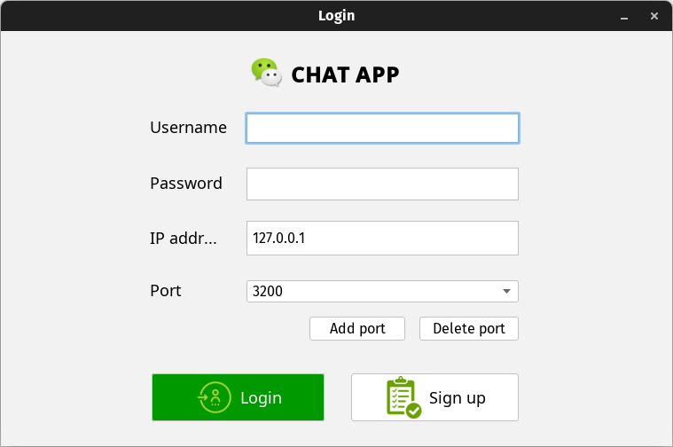
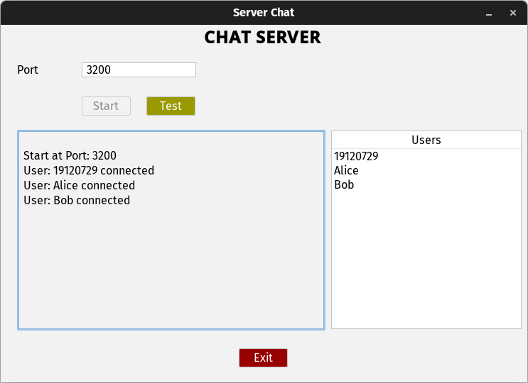

# ChatApp-Java





### Features

+ Register chat account (saved in MariaDB/MySQL database)
+ Chat 1v1
+ Chat with many people at the same time (Multithreading)
+ Chat Group
+ Send file


### Build and Run Project

#### Create database

Firstly, because the program uses MariaDB to store user data, we need to create and run the database

- We need to type commands to log in as root. by typing the command: 

  ```shell
  mysql -u root -p
  ```

  

- Next, we need to create a database named “chatUser” with the following comand:

  ```sql
  CREATE DATABASE chatUser;
  ```

  

- Run the following SQL script to create the table:

  ```sql
  DROP TABLE IF EXISTS chatUser;
  
  CREATE TABLE chatUser (
    username varchar(50) NOT NULL primary key,
    userpassword varchar(256) DEFAULT NULL
  )
  ```

#### Build the project

- Go to the project directory and type the following command:

  ```shell
  mvn install
  ```

  

- After maven says "BUILD SUCCESS", the `.jar` file will be in the directory called `target`, go to that directory and execute the java program by typing the following command:

  ```shell
  java -jar ChatClient-1.0-SNAPSHOT-jar-with-dependencies.jar
  ```

- Note, there will be 2 `.jar` files, we need to select the file whose name includes the word “with-dependencies.” For the ChatServer project we also do the same. The following screen shot is the result of the application running successfully:

  


